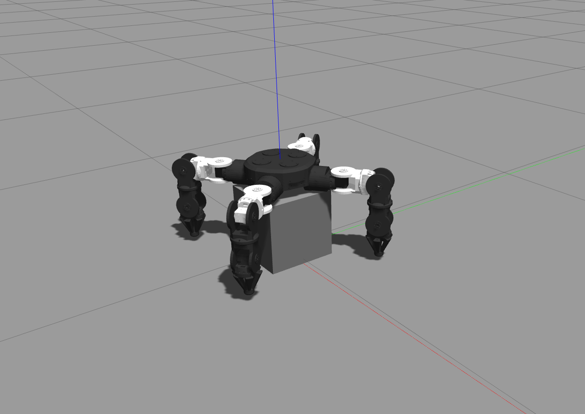

# Moonbot software

This repository includes packages for moonbot control and simulation development. Moonbot is the first model modular robot of the Moonshot project. The targets of this robot are self-reconfigurable and self-assembly abilities. We also aims to perform a simulation of moonbot tasks on the lunar surface simulation in Isaac sim. Please look into the repository and give us various recommendations for the furthur development.

## Prerequisties
* Ubuntu 20.04
* ros2-foxy

## Installation
* Installation of ros2-foxy: [https://docs.ros.org/en/foxy/Installation/Alternatives/Ubuntu-Development-Setup.html](), and source the ros2 package in the terminal.
```bash
source /opt/ros/foxy/setup.bash
```

* Install dependencies
```bash
rosdep install --from-paths src --ignore-src -r -y
```
Install program
```bash
cd ros2_ws/src

colcon build --symlink-install

source install/setup.bash
```

## Usage of Dynamixel control
* "trial" package   
This package is a package for simple control of Dynamixel servo usinng python with ros2. Please refer to this URL [https://emanual.robotis.com/docs/en/dxl/dxl-quick-start-insert]() for how to connect Dynamixel to the PC.

After connecting the 
```bash
## terminal 1
ros2 run trial dynacmixel_control.py
```
to set position
```bash
## terminal 2 
ros2 topic pub 1 /set_position dynamixel_custom_interfaces/msg/SetPosition "{id: 1, position: 1000}"
```
to ask the current position
```bash
## terminal 2 
ros2 service call /get_position dynamixel_custom_interfaces/srv/GetPosition "id: 1"
```

## Usage of Moonbot simulation and control
To spawn the moonbot model in Gazebo simulation
```bash
ros2 launch moonbot_gazebo spawn_robot_ros2.launch.xml
```


## Contributing

Pull requests are welcome. For major changes, please open an issue first
to discuss what you would like to change.

Please make sure to update tests as appropriate.
